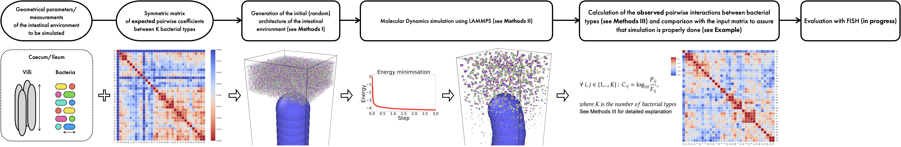

# Gorgona: a python-based tool for intestinal environment simulations with lammps

The simulation tool was developed within T3.6 of the 3D'omics project. 

To install Gorgona:

1. Clon this repo locally
2. Create a conda environment based on the provided `environment.yml` file: `conda env create -f environment.yml`
3. Activate the environment: `conda activate gorgona`
4. Install Gorgona by running `pip install -e .`

Follow Jupyter notebooks in the folder `examples` to run Gorgona on the example input data.
For LAMMPS and OVITO installation instructions see `INSTALL.md`.
